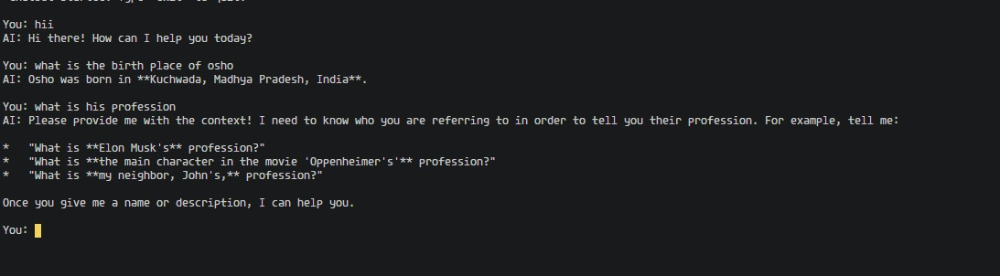
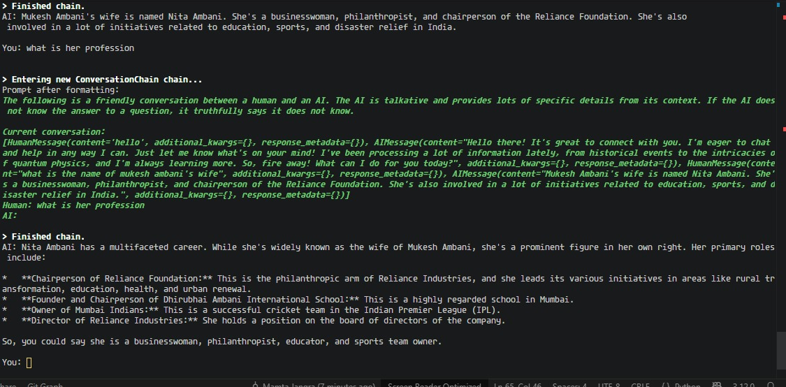

# mini_AI_chatbot

A simple terminal-based AI chatbot project using [LangChain](https://python.langchain.com/) and Gemini LLM (Google Generative AI). This project demonstrates two chatbot modes:

- **Simple Chatbot:** Answers questions without memory.
- **Advanced Chatbot:** Remembers previous conversation context.

## What is LangChain?

[LangChain](https://python.langchain.com/) is a Python framework that helps developers build applications powered by large language models (LLMs). 
It allows easy integration of AI models with memory, tools, and external data sources for creating context-aware and intelligent chatbots.

## Features:

- Uses Gemini-2.0-flash model via LangChain.
- Loads API keys from `.env` file.
- Simple chatbot (`simple_ai_bot.py`): stateless, no memory.
- Advanced chatbot (`advance_ai_bot.py`): remembers chat history using buffer memory.
- Runs in your terminal.
- Memory-enabled chatbot can give context-aware responses.

## Screenshots:

### Simple Chatbot Example


### Advanced Chatbot Example


## Setup

1. **Clone the repository**
```sh
git clone <repo-url>
cd mini_AI_chatbot

2. Install dependencies
pip install langchain google-generativeai python-dotenv

3. Set up your .env file
Create a .env file in the project root:
GOOGLE_API_KEY=your_google_api_key_here

Usage

-Simple Chatbot (No Memory):
python simple_ai_bot.py
- Type your message and press Enter.
- Type exit or quit to stop.

-Advanced Chatbot (With Memory):
python advance_ai_bot.py
- Remembers previous messages for context-aware replies.
- Type exit or quit to stop.

Future Improvements:
- Add a web interface or Telegram bot integration.
- Support voice input and output.
- Add logging and analytics for chat interactions.
- Enhance memory with summarization for long conversations.

Files

- simple_ai_bot.py: Stateless chatbot.
- advance_ai_bot.py: Chatbot with memory.
- .env: Store your Google API key (not tracked by git).
- .gitignore: Ignores .env file.

Notes
- Requires a valid Google Generative AI API key.
- For educational/demo purposes only.